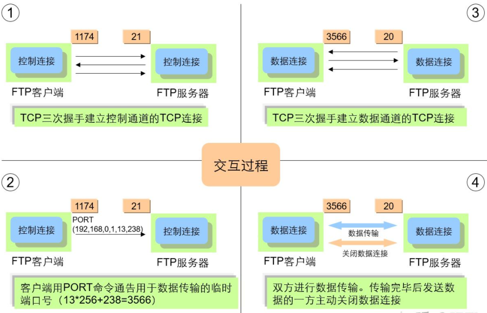
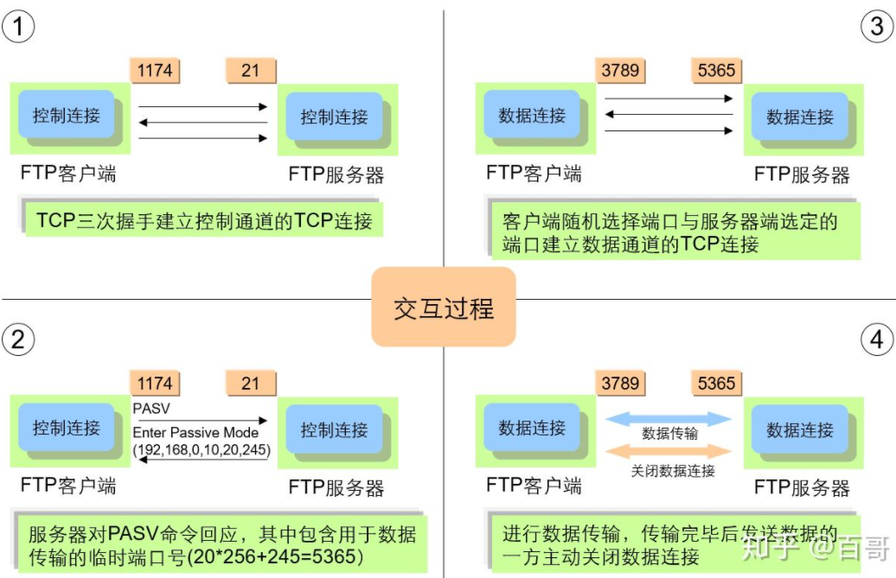
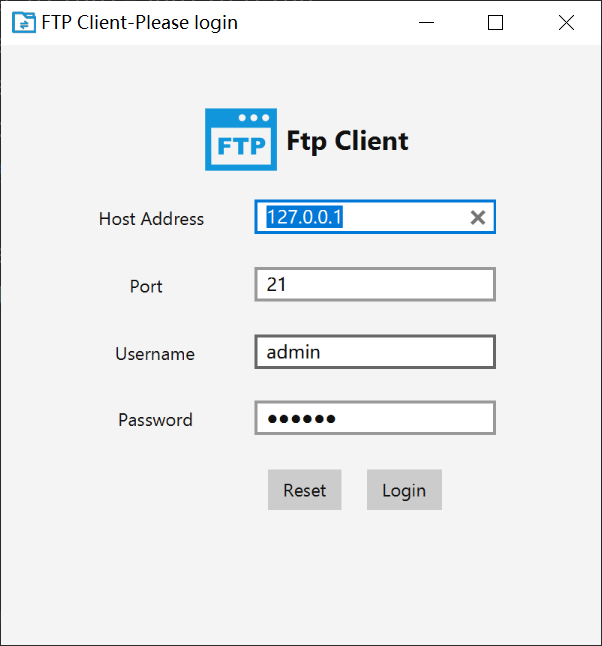
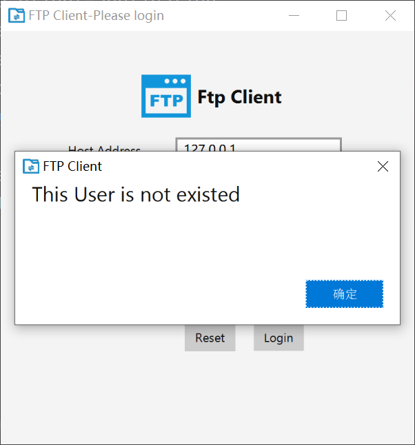
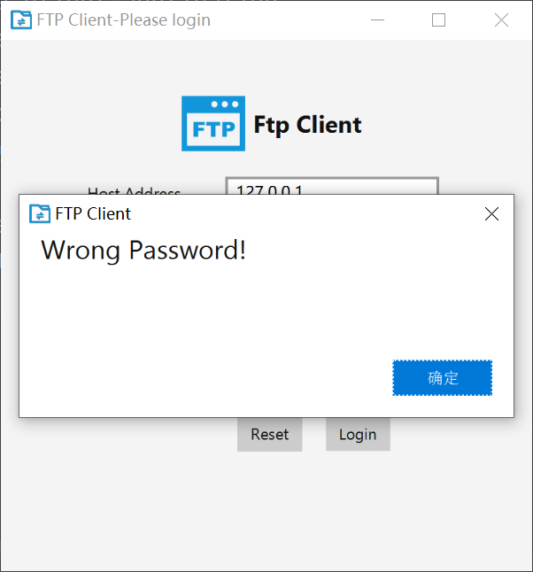
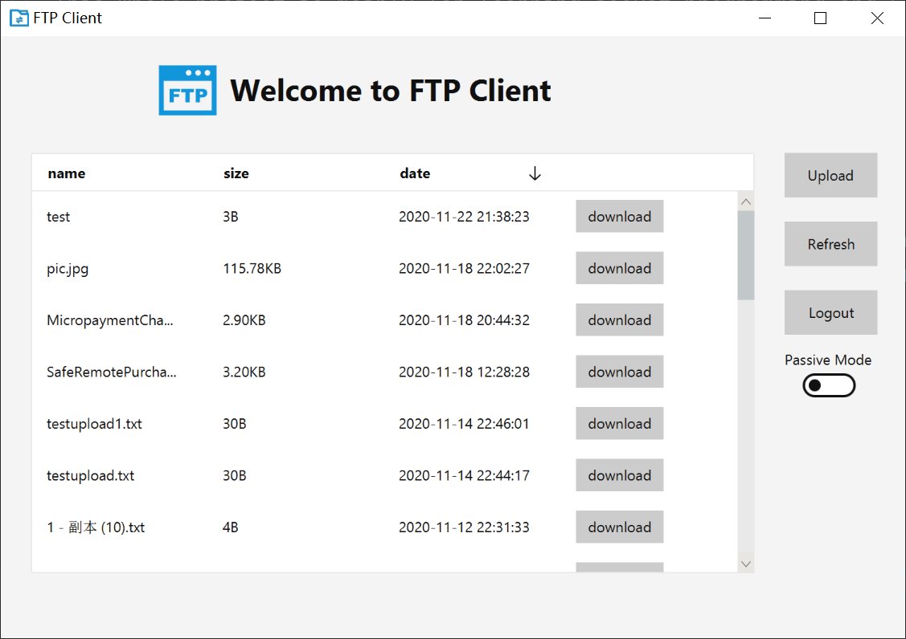
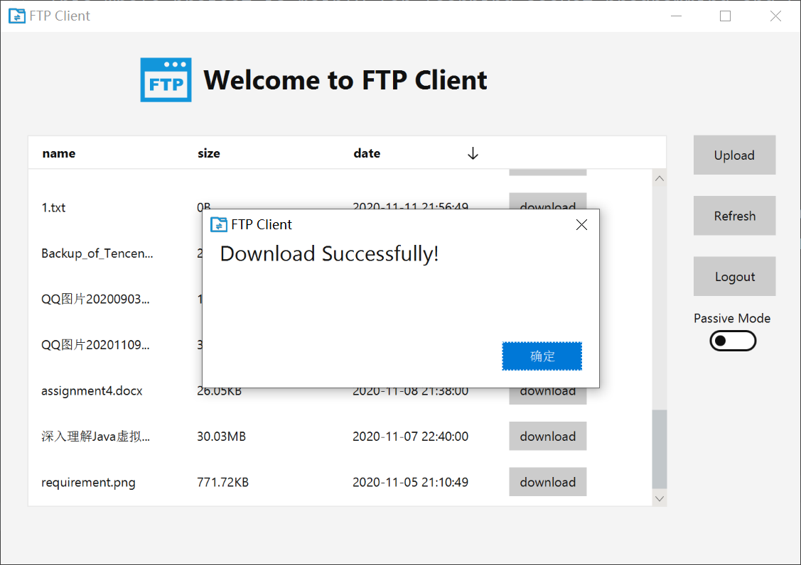
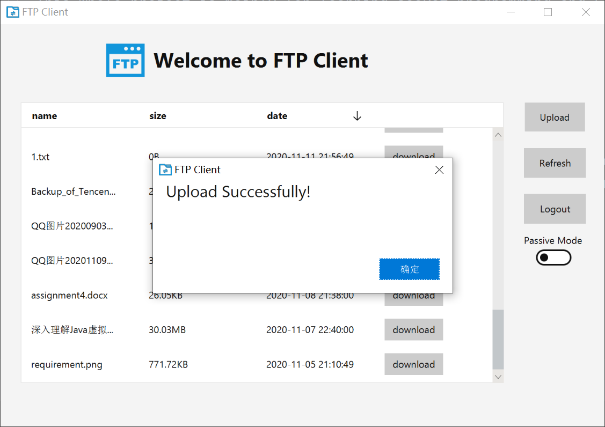
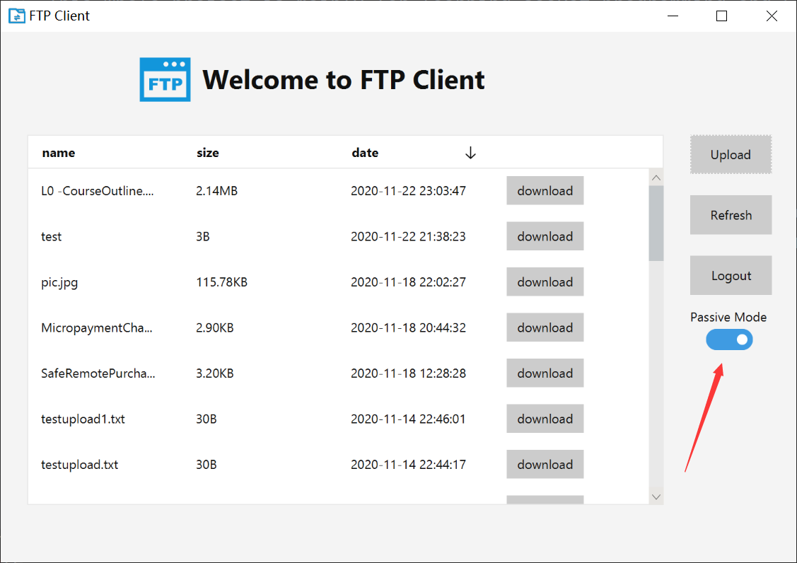

# COMP5311 Final Project - FTP_Client
## Introduction
  整个项目主要是为了学习socket编程和FTP传输协议。这是客户端部分。  
  + Environment: JDK 1.8
  + IDE: Intellij IDEA
  + Dependencies: [JMetro](https://github.com/JFXtras/jfxtras-styles ), [ControlsFX](https://github.com/controlsfx/controlsfx)

  客户端实现了用户登录，获取文件列表，刷新文件列表，下载文件和上传文件的功能。同时也实现了主动模式和被动模式的切换功能。客户端UI主要使用JavaFx来实现，同时使用了JMetro主题美化了界面, JMetro 是一款仿Windows 10的JavaFx主题。文件传输部分主要使通过socket编程来实现客户端和服务器端之间的通信。

## command definition
  + **USER** + *username*  --> tell server the username  
  + **PASS** + *password* --> tell server the password  
  + **LIST** --> client wants to get the list of all files
  + **STOR** + *filename* --> client wants to upload a file 
  + **RETR** + *filename* --> client wants to download a file
  + **QUIT** --> client wants to disconnect with the server
  + **MYPORT** + *url* + *port*  --> in the active mode, client tells the server the port of socket which is responsible for data transmission
  + **PASV** --> client tells the server, he wants to use passive mode

## Review
  这次项目，使我了解到了Java socket编程的常用方法，同时加深了我对FTP传输协议的理解，尤其是**主动模式**和**被动模式**的区别。  
    
  主动FTP，数据连接由服务器发起，也就是三次握手的第一次是服务器先来的，端口号服务器端20，客户端随机，这时按题主的操作，只要放行20和21就可以。其中21是控制连接的端口号。
    

  被动FTP，数据连接由客户端发起，也就是三次握手的第一次是客户端先来的，端口号服务器端和客户端都是随机，下图为被动FTP的工作过程
    

## Preview  
    
    
    
    
    
    
    